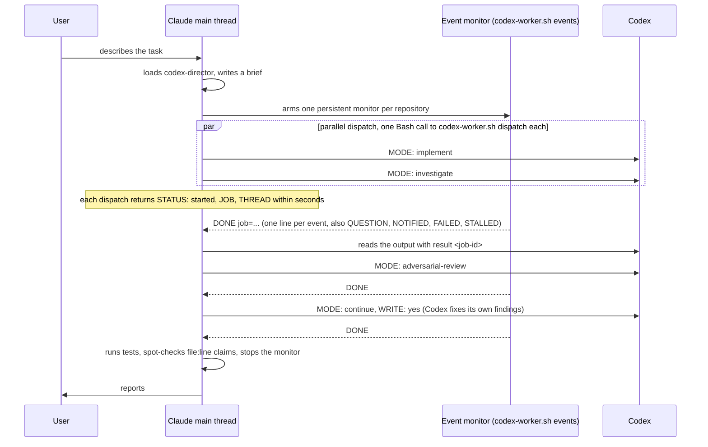

# codex-director

English | [中文](README.zh-CN.md)

Make Claude Code hand off code reading, debugging, implementation, and code review to Codex. Claude keeps only three jobs: talking to the user, writing the task brief, and judging the result.

Use it when you run both Claude Code and Codex (ChatGPT subscription), Claude's quota or context is the tighter resource, and you want Claude to read fewer files and write less code.

## What it consists of

Three files and one config snippet:

| File | Purpose |
|---|---|
| `skills/codex-director/SKILL.md` | Working rules for the Claude main thread: what to delegate, how to write a brief, how to run things in parallel, how the review loop works |
| `skills/codex-director/scripts/codex-worker.sh` | All dispatch logic: picks the Codex command by MODE, prepends the director note, starts Codex through the plugin's `codex-companion.mjs`, waits, collects; `dispatch` starts a job in one call, `events` streams job events for the director's monitor |
| `agents/codex-worker.md` | Fallback subagent with only the Bash tool, used when the event monitor is not available. It writes the brief to a file, calls the worker script, waits, and returns the output unchanged |
| `docs/claude-md-snippet.md` | A routing rule for `CLAUDE.md` so that matching tasks always go through this path |

Flow:



## Relationship to the official Codex plugin

This depends on the Codex plugin for Claude Code. Every call to Codex goes through its `codex-companion.mjs` script. The recommended install is [y-cruce/codex-plugin-cc](https://github.com/y-cruce/codex-plugin-cc), a fork of [openai/codex-plugin-cc](https://github.com/openai/codex-plugin-cc) that adds `task --thread <id>` (submitted upstream as [#719](https://github.com/openai/codex-plugin-cc/pull/719)); nothing else in the plugin is changed. This repo adds a layer of delegation rules and one forwarding agent on top.

The plugin ships its own forwarder, `codex:codex-rescue`. The differences:

| | Official codex-rescue | codex-worker (this repo) |
|---|---|---|
| Trigger | User runs `/codex:rescue`, or Claude asks for help when stuck | Claude delegates by default according to the rules; the user never has to mention Codex |
| Writes files by default | Yes (`--write`) | Depends on MODE: `investigate` is read-only, only `implement` writes |
| Long runs | Waits in the foreground and gets killed at Claude Code's 10-minute Bash limit | Starts Codex in the background and suspends; Codex can run as long as it needs |
| Review input | Working-tree mode inlines the content of every untracked file into the prompt; repos with many untracked files exceed Codex's input limit | Uses branch mode when a base ref is given; otherwise counts untracked files and, above 3, falls back to a read-only task that reviews via git itself |
| Output | Verbatim | Verbatim, with a single `STATUS:` line prepended |
| Language | English | All prompts and rules are in English; neither Codex nor Claude is forced to answer in a particular language |

## Install

Prerequisites:

1. Claude Code (tested with 2.1.259)
2. Codex CLI installed and logged in (tested with 0.152.1): `npm install -g @openai/codex && codex login`
3. The Codex plugin for Claude Code, installed from this fork of the official plugin: [y-cruce/codex-plugin-cc](https://github.com/y-cruce/codex-plugin-cc). It is upstream 1.0.6 plus `task --thread <id>` ([openai/codex-plugin-cc#719](https://github.com/openai/codex-plugin-cc/pull/719)), which codex-director needs to keep one Codex thread per problem. In a terminal:

   ```bash
   claude plugin uninstall codex@openai-codex   # only if the official one is installed
   claude plugin marketplace add y-cruce/codex-plugin-cc
   claude plugin install codex@y-cruce-codex
   ```

   Then run `/codex:setup` in Claude Code and confirm it reports ready. The official plugin also works, but without `--thread` codex-worker can only resume the most recent thread (see "Thread continuity").

Install this repo:

```bash
git clone https://github.com/y-cruce/codex-director.git
cd codex-director
./install.sh
```

The script copies the agent, the skill, and the worker script into `~/.claude/`. Then append the snippet from `docs/claude-md-snippet.md` to `~/.claude/CLAUDE.md` and run `/reload-plugins` in Claude Code, or start a new session.

## Usage

No new commands. Talk to Claude as usual:

```
This endpoint returns 500 occasionally, find out why
Make order export asynchronous and send an email when it finishes
Review the changes on this branch
```

Claude loads codex-director, writes a brief, dispatches it to Codex, waits for the monitor's event, spot-checks, and reports. You can also name it directly: "ask codex to look into X".

### Brief format

What Claude hands to the worker script (or to the fallback codex-worker agent). A few header lines carry control parameters; after a blank line comes the body Codex reads:

```
MODE: implement
EFFORT: high

## Goal
...
## Context
...
## Constraints
...
## Acceptance
...
```

| MODE | What it does | Writes files |
|---|---|---|
| `investigate` | Read code, trace call chains, find root causes | No |
| `implement` | Implement according to the brief | Yes |
| `continue` | Continue the previous Codex thread | Only with `WRITE: yes` in the header |
| `review` | The plugin's standard review | No |
| `adversarial-review` | Challenge-style review; the body is the focus text | No |
| `wait` | Keep waiting on a running job (`JOB:` header); fallback when the event monitor is not available | No |

Optional headers: `EFFORT` (`medium` / `high` / `xhigh`, default high), `MODEL` (defaults to the model in your Codex config), `BASE` (base ref for review modes), `THREAD` (the Codex thread a `continue` must resume), `SIBLINGS` (one line naming other running Codex tasks, shown to Codex), `WAIT: no` (fallback agent only: return right after launch; `dispatch` always does), `CWD` (repository to run in).

### Thread continuity

Codex has a very large context window, and a thread keeps everything Codex has read so far. Follow-ups on the same problem are faster and more accurate inside the same thread, so the skill keeps **one Codex thread per problem**:

- Every task result comes back with a `THREAD: <id>` line.
- Any later dispatch about the same problem (more investigation, a follow-up question, implementing what was found, fixing review findings) uses `MODE: continue` with that `THREAD:` in the header.
- codex-worker checks the requested thread against the one the plugin is about to resume and refuses with `THREAD_MISMATCH` rather than silently continuing the wrong thread.

With a plugin that supports `task --thread <id>` ([openai/codex-plugin-cc#719](https://github.com/openai/codex-plugin-cc/pull/719)), codex-worker resumes exactly the requested thread, so problems can be interleaved freely. Older plugin versions can only resume the most recent finished task thread of the current Claude session in the repo; there codex-worker falls back to a candidate check, and Claude avoids starting other task-class jobs in that repo between two `continue` calls.

### Checking progress

While Codex is running, `/codex:status` lists the running and recently finished jobs in the current repo with their current phase. `/codex:result <job-id>` shows the full output of one job.

## Design decisions

**Codex output is never compressed.** Claude reads Codex's result with `result <job-id>`, and the fallback forwarder returns Codex's stdout unchanged. Claude's context is saved by the division of labor itself (Claude does not read files or write code), not by truncating or summarizing Codex's answer.

**One thread per problem, review only when it earns its cost.** For code changes, `implement` runs first (or `investigate` then `continue` with the implementation when the affected area is unclear). When the implementation comes back, Claude judges whether an `adversarial-review` is worth its cost for this particular change and says so either way. Findings go back to the same thread via `continue` to fix, up to three rounds.

**Parallel writes use worktrees.** Only one `implement` runs per checkout at a time. To have Codex produce two approaches, give each route its own `git worktree` and pass it as `CWD:` (or `isolation: "worktree"` on the fallback agent), and Claude picks one.

**Detached start, events instead of waits.** Task runs use native background jobs; `dispatch` returns as soon as the job id is known and the event monitor reports completion, questions, and notes. Without the monitor, the fallback worker waits in foreground `status --wait` calls of under 10 minutes and returns on completion or a structured question; after a question, the director answers and collects that same job. Reviews and older plugins retain the detached-process wait loop.

**Decision logic lives in shell, not in the model's judgment.** For review modes, the choice between branch mode, working-tree mode, and the fallback is a fixed script. Claude pastes the brief into `codex-worker.sh dispatch` and fills in nothing else; the fallback agent does the same through `launch`.

**Simple tasks are not delegated.** Anything Claude can finish in about three tool calls without understanding unfamiliar code (a lookup, a grep, a few-line fix at a known place, running a command) is done directly; a dispatch costs a brief and at least a minute of waiting.

**Claude writes the documents.** Human-facing documents and pages are not delegated; Codex only gathers material. This rule constrains Claude's side only and is not written into briefs, so Codex updating comments or a README while coding is left alone.

## Known limitations

- Without the event monitor, each wait round is a Bash call of about 9.5 minutes; a long Codex run therefore shows up as several consecutive wait calls in the forwarder's transcript. That is expected.
- Edits to agent definitions in `~/.claude/agents/` do not take effect in the current session until `/reload-plugins` or a new session.
- The plugin's `review` mode does not accept focus text; only `adversarial-review` does.
- `continue` starts a later turn. For an active task use `message` or `answer`; older plugins without live controls must wait for completion.
- The plugin keeps one shared Codex runtime per Claude session and plugin install path, and that runtime holds a writer lock on every thread it created. After switching the plugin install (for example from `codex@openai-codex` to `codex@y-cruce-codex`), start a new Claude session; threads created under the old install are held by the old runtime until it exits.
- Tested on macOS only. The scripts use `python3` and standard shell tools; Linux should work but is untested.

## Live Corrections and Answers

With a plugin version supporting live controls, `/codex:message <job-id> <text>` appends input to the running turn. Add `--interrupt` to cancel that turn and continue the same job and thread with the new direction. Existing edits remain and write permissions do not change. Acceptance means queued for a later model request, not that the instruction has already been followed.

For a structured question, the director receives `STATUS: waiting-for-answer` (from a waiting worker) or a `QUESTION` event (from the monitor, see below) while Codex remains active. It supplies an answers-map JSON file, such as `{"source":{"answers":["Use the latest plan."]}}`, through `/codex:answer <job-id> --request-id <id> --answers-file <path>`. Without the monitor it then dispatches the worker again with `MODE: wait` and `JOB: <job-id>` to keep waiting on the same job. Questions time out after 10 minutes. `/codex:status <job-id>` exposes pending messages, questions, notifications, and interruption state.

**Event monitor instead of waiting workers.** On plugins with the `events` subcommand, the director arms one persistent Claude Code Monitor per repository running `codex-worker.sh events --cwd <repo>`, and starts each job with one Bash call to `codex-worker.sh dispatch`, which returns right after launch. Each job event then lands in the director's conversation as one line: `DONE`, `FAILED`, `QUESTION`, `NOTIFIED`, or `STALLED`. No subagent at all, no 9.5-minute rounds, one channel for all jobs. The waiting codex-worker agent and `MODE: wait` remain the fallback for older plugins or sessions without the Monitor tool.

Codex knows who started it. For `investigate` and `implement`, the worker script prepends a short note to the brief: Codex was started by a director agent rather than a human, `request_user_input` questions go to the director, other Codex tasks may be running (listed from the director's `SIBLINGS:` header) and Codex must not coordinate with them itself. On plugins that expose the `notify_director` tool, Codex can also send the director a one-line note without stopping; it arrives as a `NOTIFIED` event or as `STATUS: notified` from a waiting worker while the job keeps running. Codex tasks never talk to each other; the director relays.

The fallback worker agent is a thin wrapper: it writes its input to a file and calls `skills/codex-director/scripts/codex-worker.sh` (`launch`, `wait`, `collect`); `dispatch` is `launch` plus `collect` without waiting. All command selection, review fallbacks, and the director note live in that script, so the logic can be tested with `bash -n` and a stub companion.

Native next-turn queues are distinct from these mid-turn controls. Update the installed plugin and restart the Claude session to use the new broker; editing this checkout does not update installed copies.

## License

MIT
