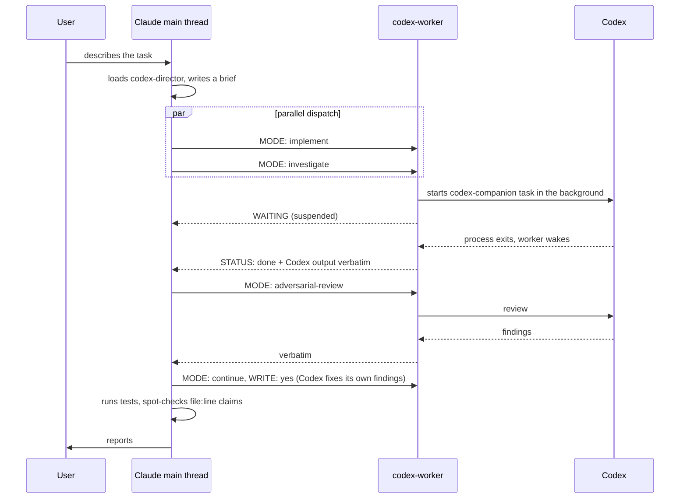

# codex-director

English | [中文](README.zh-CN.md)

Make Claude Code hand off code reading, debugging, implementation, and code review to Codex. Claude keeps only three jobs: talking to the user, writing the task brief, and judging the result.

Use it when you run both Claude Code and Codex (ChatGPT subscription), Claude's quota or context is the tighter resource, and you want Claude to read fewer files and write less code.

## What it consists of

Two files and one config snippet:

| File | Purpose |
|---|---|
| `skills/codex-director/SKILL.md` | Working rules for the Claude main thread: what to delegate, how to write a brief, how to run things in parallel, how the review loop works |
| `agents/codex-worker.md` | A subagent with only the Bash tool. It takes a brief, calls the official Codex plugin's script, runs Codex in the background, and returns the output unchanged |
| `docs/claude-md-snippet.md` | A routing rule for `CLAUDE.md` so that matching tasks always go through this path |

Flow:



## Relationship to the official Codex plugin

This depends on [openai/codex-plugin-cc](https://github.com/openai/codex-plugin-cc). Every call to Codex goes through its `codex-companion.mjs` script. Nothing in the plugin is modified; this repo adds a layer of delegation rules and one forwarding agent on top.

The plugin ships its own forwarder, `codex:codex-rescue`. The differences:

| | Official codex-rescue | codex-worker (this repo) |
|---|---|---|
| Trigger | User runs `/codex:rescue`, or Claude asks for help when stuck | Claude delegates by default according to the rules; the user never has to mention Codex |
| Writes files by default | Yes (`--write`) | Depends on MODE: `investigate` is read-only, only `implement` writes |
| Long runs | Waits in the foreground and gets killed at Claude Code's 10-minute Bash limit | Starts Codex in the background and suspends; Codex can run as long as it needs |
| Review input | Working-tree mode inlines the content of every untracked file into the prompt; repos with many untracked files exceed Codex's input limit | Uses branch mode when a base ref is given; otherwise counts untracked files and, above 3, falls back to a read-only task that reviews via git itself |
| Output | Verbatim | Verbatim, with a single `STATUS:` line prepended |
| Language | English | All prompts and rules are in English; neither Codex nor Claude is forced to answer in a particular language |

## Install

Prerequisites:

1. Claude Code (tested with 2.1.259)
2. Codex CLI installed and logged in (tested with 0.152.1): `npm install -g @openai/codex && codex login`
3. The official Codex plugin (tested with 1.0.6): run `/plugin install codex@openai-codex` in Claude Code, then `/codex:setup` and confirm it reports ready

Install this repo:

```bash
git clone https://github.com/y-cruce/codex-director.git
cd codex-director
./install.sh
```

The script copies the agent and the skill into `~/.claude/`. Then append the snippet from `docs/claude-md-snippet.md` to `~/.claude/CLAUDE.md` and run `/reload-plugins` in Claude Code, or start a new session.

## Usage

No new commands. Talk to Claude as usual:

```
This endpoint returns 500 occasionally, find out why
Make order export asynchronous and send an email when it finishes
Review the changes on this branch
```

Claude loads codex-director, writes a brief, dispatches codex-worker, waits, spot-checks, and reports. You can also name it directly: "ask codex to look into X".

### Brief format

What Claude sends to codex-worker. A few header lines carry control parameters; after a blank line comes the body Codex reads:

```
MODE: implement
EFFORT: high

## Goal
...
## Context
...
## Constraints
...
## Acceptance
...
```

| MODE | What it does | Writes files |
|---|---|---|
| `investigate` | Read code, trace call chains, find root causes | No |
| `implement` | Implement according to the brief | Yes |
| `continue` | Continue the previous Codex thread | Only with `WRITE: yes` in the header |
| `review` | The plugin's standard review | No |
| `adversarial-review` | Challenge-style review; the body is the focus text | No |

Optional headers: `EFFORT` (`medium` / `high` / `xhigh`, default high), `MODEL` (defaults to the model in your Codex config), `BASE` (base ref for review modes), `THREAD` (the Codex thread a `continue` must resume).

### Thread continuity

Codex has a very large context window, and a thread keeps everything Codex has read so far. Follow-ups on the same problem are faster and more accurate inside the same thread, so the skill keeps **one Codex thread per problem**:

- Every task result comes back with a `THREAD: <id>` line.
- Any later dispatch about the same problem (more investigation, a follow-up question, implementing what was found, fixing review findings) uses `MODE: continue` with that `THREAD:` in the header.
- codex-worker checks the requested thread against the one the plugin is about to resume and refuses with `THREAD_MISMATCH` rather than silently continuing the wrong thread.

Constraint inherited from the plugin: it can only resume the most recent finished task thread of the current Claude session in the repo. While a problem is in progress, Claude does not start other task-class jobs in that repo between two `continue` calls.

### Checking progress

While Codex is running, `/codex:status` lists the running and recently finished jobs in the current repo with their current phase. `/codex:result <job-id>` shows the full output of one job.

## Design decisions

**Codex output is never compressed.** The forwarder returns Codex's stdout unchanged. Claude's context is saved by the division of labor itself (Claude does not read files or write code), not by truncating or summarizing Codex's answer.

**One thread per problem, review loop inside it.** For code changes, `implement` runs first (or `investigate` then `continue` with the implementation when the affected area is unclear). When the implementation comes back, `adversarial-review` runs on it. Findings go back to the same thread via `continue` to fix, up to three rounds. Claude steps in only when the loop stalls or a judgment call is needed.

**Parallel writes use worktrees.** Only one `implement` runs per checkout at a time. To have Codex produce two approaches, dispatch the agent with `isolation: "worktree"` so each works in its own tree, and Claude picks one.

**Background start, suspend, wake.** Claude Code's Bash tool allows at most 10 minutes per foreground call. The forwarder starts Codex with `run_in_background`, then ends its turn and waits to be woken. This is the wait mechanism Claude Code provides; it costs nothing regardless of duration.

**Decision logic lives in shell, not in the model's judgment.** For review modes, the choice between branch mode, working-tree mode, and the fallback is a fixed script. The forwarder fills in MODE, BASE, and the body, nothing else.

**Claude writes the documents.** Human-facing documents and pages are not delegated; Codex only gathers material. This rule constrains Claude's side only and is not written into briefs, so Codex updating comments or a README while coding is left alone.

## Known limitations

- After starting Codex, the forwarder sends the main thread one notification containing only `WAITING`; the real result arrives when Codex exits. The skill tells Claude to ignore the first one.
- Edits to agent definitions in `~/.claude/agents/` do not take effect in the current session until `/reload-plugins` or a new session.
- The plugin's `review` mode does not accept focus text; only `adversarial-review` does.
- `continue` relies on the plugin's `--resume-last`, which refuses while another Codex job is running in the same repo. Wait for it to finish.
- Tested on macOS only. The scripts use `python3` and standard shell tools; Linux should work but is untested.

## License

MIT
