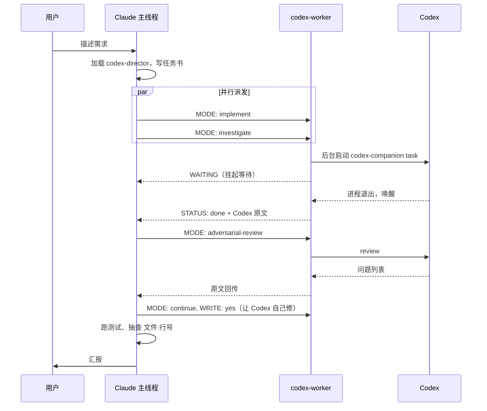

# codex-director

[English](README.md) | 中文

让 Claude Code 把读代码、排查、写实现、代码 review 全部派给 Codex，自己只负责跟用户对话、写任务书、判断结果。

适合的场景：你同时有 Claude Code 和 Codex（ChatGPT 订阅），Claude 的额度或上下文比 Codex 更紧张，想让 Claude 少读文件、少写代码，把这些活交给 Codex 做。

## 做了什么

两个文件加一段配置：

| 文件 | 作用 |
|---|---|
| `skills/codex-director/SKILL.md` | 给 Claude 主线程的工作规则：什么活派出去、任务书怎么写、并行怎么派、review 循环怎么跑 |
| `agents/codex-worker.md` | 一个只有 Bash 工具的子 agent。收到任务书后调用官方 Codex 插件的脚本，把 Codex 放到后台跑，跑完把输出原样带回 |
| `docs/claude-md-snippet.md` | 加进 `CLAUDE.md` 的路由规则，保证相关任务每次都走这条路 |

工作流程：



## 和官方 Codex 插件的关系

依赖 Claude Code 的 Codex 插件，所有对 Codex 的调用都走它的 `codex-companion.mjs` 脚本。推荐装 [y-cruce/codex-plugin-cc](https://github.com/y-cruce/codex-plugin-cc)，它是 [openai/codex-plugin-cc](https://github.com/openai/codex-plugin-cc) 的 fork，只多了 `task --thread <id>`（已提交上游 [#719](https://github.com/openai/codex-plugin-cc/pull/719)），其他没改。本仓库只在插件外面加一层分工规则和一个转发 agent。

官方插件自带的 `codex:codex-rescue` 也是转发器，区别在下面几点：

| | 官方 codex-rescue | 本仓库 codex-worker |
|---|---|---|
| 触发方式 | 用户手动 `/codex:rescue`，或 Claude 卡住时求助 | Claude 按规则默认派发，用户不用提 Codex |
| 默认是否改文件 | 默认 `--write` | 按 MODE 决定：investigate 只读，implement 才写 |
| 长任务 | 前台等待，超过 Claude Code 的 Bash 上限（10 分钟）会被杀 | 后台启动，转发器挂起等待，Codex 跑多久都行 |
| review 输入 | 工作区模式会把每个未跟踪文件的内容塞进提示词，未跟踪文件多的仓库会超出 Codex 输入上限 | 有基准分支就走分支模式；没有就数未跟踪文件，超过 3 个自动改用只读 task 做 review |
| 输出 | 原样 | 原样，只在最前面加一行 `STATUS:` |
| 语言 | 英文 | 所有提示词和规则都是英文，不会强制 Codex 或 Claude 用某种语言回复 |

## 安装

前置条件：

1. Claude Code（验证过 2.1.259）
2. Codex CLI 已安装并登录（验证过 0.152.1）：`npm install -g @openai/codex && codex login`
3. Claude Code 的 Codex 插件，从官方插件的 fork 安装：[y-cruce/codex-plugin-cc](https://github.com/y-cruce/codex-plugin-cc)。内容是上游 1.0.6 加上 `task --thread <id>`（已提交上游 [openai/codex-plugin-cc#719](https://github.com/openai/codex-plugin-cc/pull/719)），codex-director 靠它做到一个问题一个 Codex 线程。在终端执行：

   ```bash
   claude plugin uninstall codex@openai-codex   # 装过官方版才需要
   claude plugin marketplace add y-cruce/codex-plugin-cc
   claude plugin install codex@y-cruce-codex
   ```

   然后在 Claude Code 里执行 `/codex:setup` 确认状态是 ready。官方插件也能用，只是没有 `--thread`，codex-worker 只能续最近一个线程（见「线程连续性」）。

安装本仓库：

```bash
git clone https://github.com/y-cruce/codex-director.git
cd codex-director
./install.sh
```

脚本把 agent 和 skill 复制到 `~/.claude/`。然后按 `docs/claude-md-snippet.md` 把路由规则加到 `~/.claude/CLAUDE.md`，在 Claude Code 里执行 `/reload-plugins` 或重开会话。

## 使用

安装后不需要任何新命令。对 Claude 说平时的话就行：

```
这个接口偶尔返回 500，帮我查一下原因
把订单导出改成异步的，完成后发邮件通知
review 一下这个分支的改动
```

Claude 会加载 codex-director，写任务书，派 codex-worker，等结果，抽查，汇报。你也可以直接点名：「用 codex 查一下 X」。

### 任务书格式

Claude 派给 codex-worker 的内容长这样。头部几行是控制参数，空一行后是给 Codex 看的正文：

```
MODE: implement
EFFORT: high

## Goal
...
## Context
...
## Constraints
...
## Acceptance
...
```

| MODE | 做什么 | 会不会改文件 |
|---|---|---|
| `investigate` | 读代码、追调用链、排查根因 | 不会 |
| `implement` | 按任务书写实现 | 会 |
| `continue` | 接着上一轮 Codex 的线程继续 | 头部有 `WRITE: yes` 才会 |
| `review` | 官方 review | 不会 |
| `adversarial-review` | 挑刺式 review，正文写关注点 | 不会 |

可选头部：`EFFORT`（`medium` / `high` / `xhigh`，缺省 high）、`MODEL`（缺省用你 Codex 配置里的模型）、`BASE`（review 类的基准分支）、`THREAD`（`continue` 必须续上的 Codex 线程）。

### 线程连续性

Codex 的上下文窗口很大，一个线程会记住它读过的所有代码。同一个问题的后续追问放在同一个线程里，又快又准，所以技能按**一个问题一个 Codex 线程**来管：

- 每次 task 类结果都带回一行 `THREAD: <id>`。
- 同一个问题之后的所有派发（继续调查、追问、按调查结果实现、修 review 问题）都用 `MODE: continue`，头部带上这个 `THREAD:`。
- codex-worker 会核对请求的线程和插件即将续的线程是否一致，不一致就报 `THREAD_MISMATCH`，不会悄悄续到错的线程上。

插件支持 `task --thread <id>` 时（见 [openai/codex-plugin-cc#719](https://github.com/openai/codex-plugin-cc/pull/719)），codex-worker 精确续到指定线程，多个问题可以随意交错。旧版插件只能续当前 Claude 会话在这个仓库里最近一个跑完的 task 线程，codex-worker 会退回候选校验，Claude 也会避免在两次 `continue` 之间往这个仓库派其他 task 类任务。

### 看进度

Codex 在跑的时候，执行 `/codex:status` 能看到本仓库正在跑和最近完成的任务及当前阶段。`/codex:result <job-id>` 看某次的完整输出。

## 设计上的几个决定

**Codex 输出不压缩。** 转发器把 Codex 的 stdout 一字不动带回主线程。省 Claude 上下文的手段只有分工本身（Claude 不读文件、不写代码），不靠截断或摘要 Codex 的回答。

**一个问题一个线程，review 循环在线程内跑。** 改代码类任务先派 `implement`（改动范围不清楚时先 `investigate`，再在同一线程里 `continue` 做实现），实现回来后派 `adversarial-review`，有问题让 Codex 在同一线程里用 `continue` 自己修，最多三轮。Claude 只在循环卡住或需要取舍时介入。

**并行改文件用 worktree。** 同一个 checkout 里同时只跑一路 `implement`。要让 Codex 用两种方案各写一版，派 agent 时加 `isolation: "worktree"`，各改各的，Claude 最后挑。

**后台启动、挂起、唤醒。** Claude Code 的 Bash 工具前台调用最多 10 分钟。转发器用 `run_in_background` 启动 Codex，然后结束自己的回合等唤醒。这是 Claude Code 提供的等法，等多久都不占用任何东西。

**判断逻辑写进 shell，不靠模型自觉。** review 类任务的分支模式 / 工作区模式 / 兜底三选一，写成了固定脚本，转发器只填 MODE、BASE、正文三处。

**文档由 Claude 自己写。** 给人看的文档和页面不派给 Codex，Codex 只负责查素材。这条只约束 Claude 的分工，不写进给 Codex 的任务书，Codex 写代码时顺手改注释或 README 不去干预。

## 已知限制

- 转发器启动 Codex 后会先给主线程发一条只有 `WAITING` 的通知，Codex 跑完后再发真正的结果。技能里已写明忽略第一条。
- 改了 `~/.claude/agents/` 里的 agent 定义，同一会话不会立刻生效，要 `/reload-plugins` 或重开会话。
- 官方插件的 `review` 模式不接受关注点文本，只有 `adversarial-review` 接受。
- `continue` 依赖官方插件的 `--resume-last`，同仓库有别的 Codex 任务在跑时它会拒绝，等跑完再派。
- 插件按「Claude 会话 + 插件安装路径」各起一个共享的 Codex 运行时，它创建过的线程都被它持有写锁。换过插件安装来源之后（比如从 `codex@openai-codex` 换到 `codex@y-cruce-codex`），要重开 Claude 会话；旧安装下创建的线程在旧运行时退出前续不上。
- 只在 macOS 上验证过。脚本用 `python3` 和标准 shell 工具，Linux 应该能用，没测。

## 许可

MIT
